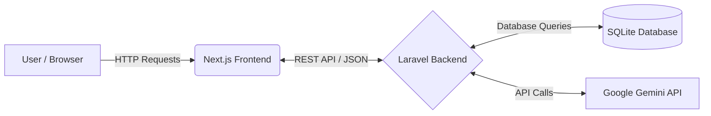

# ResumeAI

## Overview
ResumeAI is a modern web application that allows users to seamlessly generate, format, and rate their professional resumes using AI. 

## System Architecture

The application follows a decoupled client-server architecture:

- **Frontend:** Next.js (React 19, Tailwind CSS). The frontend runs as a standalone Node.js application, consuming RESTful APIs from the backend. 
- **Backend:** Laravel (PHP 8.5). The backend handles authentication via Laravel Sanctum, acts as a secure intermediary for AI operations, and manages the SQLite database.
- **AI Integration:** Google Gemini API. The PHP backend formulates prompts and interacts with the Gemini API to generate resume content and evaluate uploaded resumes.



## Setup Instructions

### Prerequisites
- Node.js (v22+)
- PHP (v8.5+)
- Composer (v2+)

### 1. Set up the Backend (Laravel)
Navigate to the `backend` directory and install the dependencies:
```bash
cd backend
composer install
```
Configure your environment variables:
```bash
cp .env.example .env
```
Generate the application key and run database migrations:
```bash
php artisan key:generate
php artisan migrate
```
**Important:** Add your Gemini API key to the `backend/.env` file:
```
GEMINI_API_KEY=your_api_key_here
```
Start the Laravel development server:
```bash
php artisan serve
```
The backend API will be available at `http://localhost:8000`.

### 2. Set up the Frontend (Next.js)
Open a new terminal and navigate to the project root directory. Install the dependencies:
```bash
npm install --legacy-peer-deps
```
Start the Next.js development server:
```bash
npm run dev
```
The frontend application will be accessible at `http://localhost:3000`.

## Code Structure
- `/app`, `/components`, `/lib`: The Next.js frontend source code (React UI, styling, and client-side logic).
- `/backend`: The Laravel backend application.
  - `app/Http/Controllers/AuthController.php`: Handles user registration, login, and profile fetching.
  - `app/Http/Controllers/ResumeAiController.php`: Manages prompts and interactions with the Gemini API.
  - `routes/api.php`: Defines the REST API endpoints.

## API Documentation
- `POST /api/auth/register`: Register a new user account.
- `POST /api/auth/login`: Authenticate and receive a Bearer token.
- `POST /api/resume/generate`: Generate a resume summary and experience bullets.
- `POST /api/resume/rate`: Rate a resume and receive actionable feedback.

## Guidelines
Copyright (c) 2026 Dhruv Singh.  
All rights reserved.  
Unauthorized use, modification, and distribution of this code are strictly prohibited.
